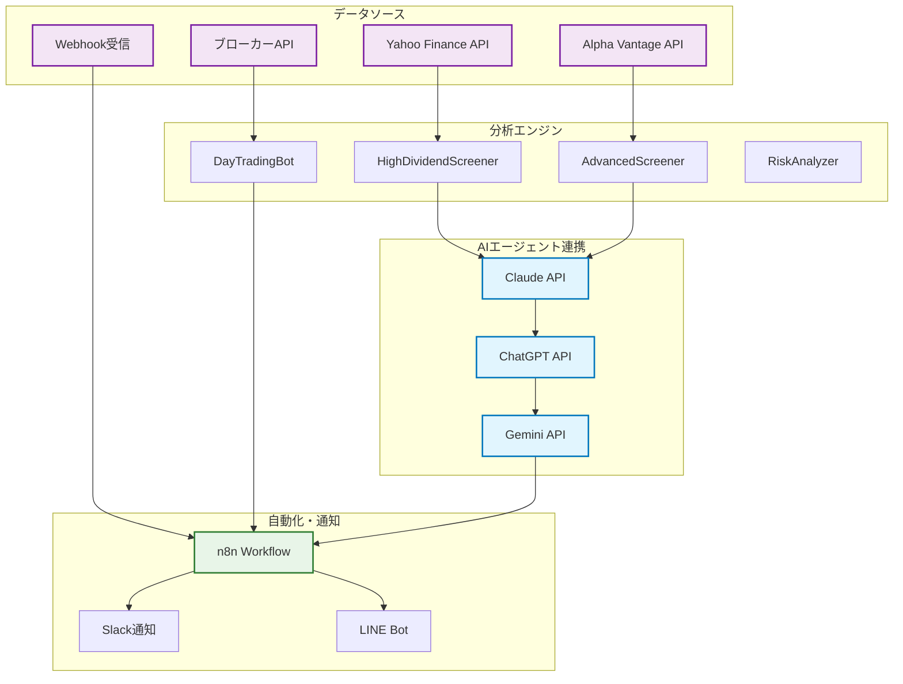

# システムアーキテクチャ図

## 全体システム構成

```mermaid
graph TB
    subgraph "データソース"
        YF[Yahoo Finance API]
        AV[Alpha Vantage API] 
        BD[ブローカーAPI]
        WH[Webhook受信]
    end

    subgraph "分析エンジン"
        HDS[HighDividendScreener]
        AS[AdvancedScreener]
        DTB[DayTradingBot]
        RA[RiskAnalyzer]
    end

    subgraph "AIエージェント連携"
        CLAUDE[Claude API]
        GPT[ChatGPT API]
        GEMINI[Gemini API]
    end

    subgraph "自動化・通知"
        N8N[n8n Workflow]
        SLACK[Slack通知]
        LINE[LINE Bot]
    end

    %% データフロー
    YF --> HDS
    AV --> AS
    BD --> DTB
    WH --> N8N
    
    HDS --> CLAUDE
    AS --> CLAUDE
    DTB --> N8N
    
    CLAUDE --> GPT
    GPT --> GEMINI
    GEMINI --> N8N
    
    N8N --> SLACK
    N8N --> LINE

    classDef aiNode fill:#e1f5fe,stroke:#0277bd,stroke-width:2px
    classDef dataNode fill:#f3e5f5,stroke:#7b1fa2,stroke-width:2px
    classDef systemNode fill:#e8f5e8,stroke:#2e7d32,stroke-width:2px

    class CLAUDE,GPT,GEMINI aiNode
    class YF,AV,BD,WH dataNode
    class N8N systemNode
```

**作成日**: 2025-08-08  
**図式形式**: Mermaid
